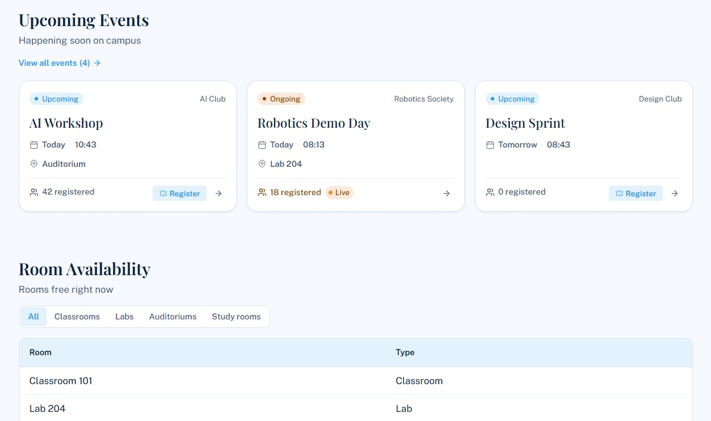
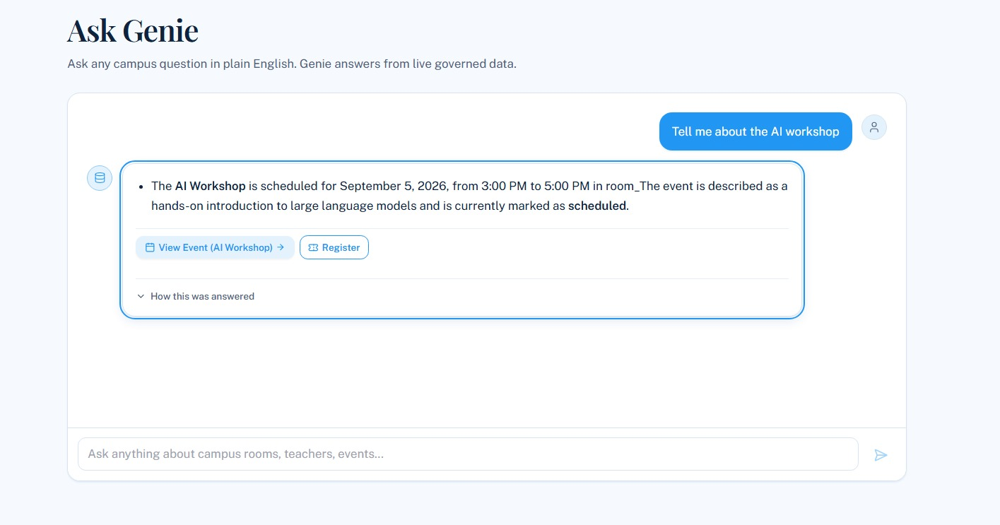
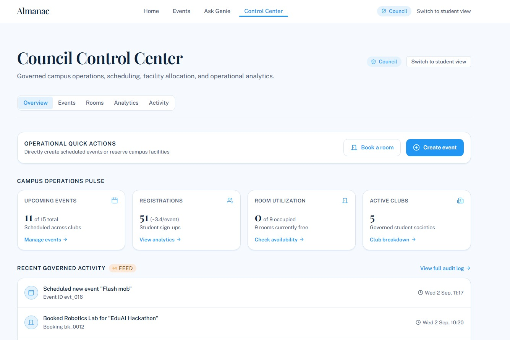
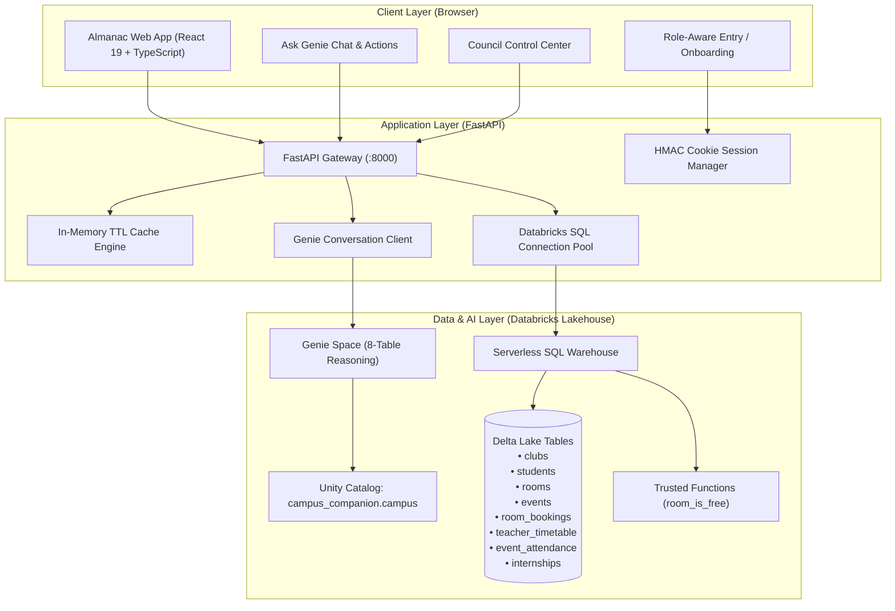

<div align="center">

# Almanac
### *One place to ask, discover, and act on what's happening on campus.*

[](https://databricks.com/)
[](https://fastapi.tiangolo.com/)
[](https://react.dev/)
[](https://tailwindcss.com/)
[](backend/tests/)

</div>

---

## Overview

**Almanac** is an intelligent campus information and governance platform powered by **Databricks Unity Catalog**, **Serverless SQL Warehouses**, and **Databricks Genie**. It bridges the gap between students looking for events, career opportunities, and study rooms, and campus councils managing room bookings, event rosters, and organizational analytics.

Instead of navigating fragmented spreadsheets and bulletin boards, Almanac provides:
1. **Students**: A live newsletter home, interactive calendar, 1-click event registration with profile autofill, internship discovery, and natural-language queries via **Ask Genie**.
2. **Student Council and Administrators**: A centralized **Control Center** to schedule events, reserve rooms with automated overlap conflict detection, analyze club engagement, and inspect live student registration rosters.

---

## Visual Tour and Key Interfaces

### 1. Student Homepage and Campus Pulse
The student landing hub featuring **Campus Pulse** (events happening right now, upcoming highlights, free room count, and daily registrations), quick access links, and trending campus activities.


---

### 2. Interactive Campus Calendar
A month-at-a-glance interactive calendar view showing scheduled club workshops, hackathons, and sports meets with real-time status badges.


---

### 3. Events Directory and 1-Click Registration
Browse, search, and filter events by club, date, or topic. Students can register instantly with cached profile autofill and built-in duplicate registration protection.



---

### 4. Ask Genie (Natural Language Query Layer)
Powered by **Databricks Genie**, students and staff can ask plain English questions about campus facilities, faculty availability, upcoming events, and career opportunities. Almanac executes queries directly against governed Delta Lake tables and renders verifiable SQL alongside interactive action triggers.



---

### 5. Council Control Center and Live Attendee Rosters
A role-gated administrative suite for student councils and club leads. Includes real-time event creation with room overlap checks, 1-click event cancellation, room occupancy analytics, and interactive student attendee tables.



---

## Key Capabilities and Technical Features

* **Governed NL-to-SQL (Databricks Genie)**: Multi-table natural language reasoning across 8 Unity Catalog tables with zero hallucination guarantees, action deep-links (`#register:<id>`), and strict out-of-scope boundaries.
* **Conflict-Free Room Reservations**: Automated temporal overlap detection (`[start_ts, end_ts)`) ensuring no two clubs can double-book classrooms, auditoriums, or labs.
* **High-Performance Lakehouse Architecture**:
  * **Thread-Safe Connection Pooling**: Persistent authenticated Thrift sessions eliminating remote handshake latency on every query.
  * **In-Memory TTL Smart Cache**: High-speed caching with instant write-through invalidation (`cache.invalidate_all()`) on all state modifications.
* **Live Attendee Roster Tables**: Council members can click on any event in the Control Center to view registered students with full names, campus emails, academic majors, and registration timestamps.
* **Duplicate Registration Prevention**: Built-in duplicate detection rejecting duplicate event signups per student and email with HTTP 409 conflict handling.
* **Modern UI/UX Tokens**: Accessible, high-contrast, responsive interface built with React 19, Lucide icons, and Tailwind CSS.

---

## Architecture



---

## Governed Data Model (Unity Catalog)

All data is stored in Delta Lake under the Unity Catalog namespace `campus_companion.campus`:

| Table | Description | Key Columns |
| :--- | :--- | :--- |
| `clubs` | Campus student organizations and societies | `club_id`, `name`, `category`, `active` |
| `students` | Student demographic and major directory | `student_id`, `name`, `email`, `major`, `year` |
| `rooms` | Classrooms, auditoriums, study rooms, and labs | `room_id`, `name`, `type`, `capacity`, `building` |
| `events` | Official campus events, workshops, and meets | `event_id`, `name`, `club_id`, `room_id`, `start_ts`, `end_ts`, `status` |
| `room_bookings`| Reserved room time slots with status tracking | `booking_id`, `room_id`, `event_id`, `start_ts`, `end_ts`, `status` |
| `teacher_timetable` | Faculty class and office hour schedules | `timetable_id`, `teacher_name`, `room_id`, `start_ts`, `end_ts` |
| `event_attendance` | Verified student event registration records | `attendance_id`, `event_id`, `student_id`, `registrant_email`, `registered_at` |
| `internships` | Curated campus career and internship postings | `internship_id`, `company_name`, `role_title`, `stipend`, `status` |

---

## Getting Started

### 1. Prerequisites
* **Python 3.11+** (Python 3.13 recommended)
* **Node.js 18+** and **npm**
* Active **Databricks Workspace** with Unity Catalog, Serverless SQL Warehouse, and Genie Space.

---

### 2. Environment Configuration

Create a `.env` file inside the `backend/` directory:

```ini
# backend/.env

# Databricks Workspace URL
DATABRICKS_HOST=https://dbc-xxxxxxxx-xxxx.cloud.databricks.com

# Personal Access Token (User Settings -> Developer -> Access tokens)
DATABRICKS_TOKEN=dapi...

# SQL Warehouse ID (SQL Warehouses -> Connection Details)
SQL_WAREHOUSE_ID=your-warehouse-id

# Genie Space ID (from Genie Space URL)
GENIE_SPACE_ID=01f1...

# Unity Catalog Schema
UNITY_CATALOG_SCHEMA=campus_companion.campus

# Council Mode Passcode
COUNCIL_ACCESS_CODE=council2026

# Session Cookie Signing Secret (generate via: python -c "import secrets; print(secrets.token_hex(32))")
SESSION_SIGNING_SECRET=c3f91a78e4b6d0e82f143a579b28c049e7123456789abcdef0123456789abcde

# Ingestion Token for External Google Forms / Webhooks
INGEST_TOKEN=almanac-ingest-secret-2026
```

---

### 3. Backend Setup

```bash
cd backend
python -m venv venv

# Windows PowerShell:
.\venv\Scripts\Activate.ps1
# Linux / macOS:
# source venv/bin/activate

pip install -r requirements.txt
python -m uvicorn app.main:app --port 8000 --reload
```
The FastAPI backend will start at `http://localhost:8000`.

---

### 4. Frontend Setup

```bash
cd frontend
npm install
npm run dev -- --host
```
The Almanac web application will be live at `http://localhost:5173`.

---

### 5. Running Automated Tests

Run the full backend test suite (106 unit and integration tests):

```bash
cd backend
pytest
```

---

## Roles and Access

* **Student View**: Default mode upon opening the app. Allows browsing events, viewing campus pulse, checking room schedules, exploring internships, and conversing with **Ask Genie**.
* **Council Access**: Click **Council access** in the top navigation and enter your configured `COUNCIL_ACCESS_CODE` (e.g. `council2026`) to unlock the **Control Center**, event management, room reservation dispatch, and attendee rosters.

---

<div align="center">
<b>Almanac</b> — Built for the Campus Community.
</div>
